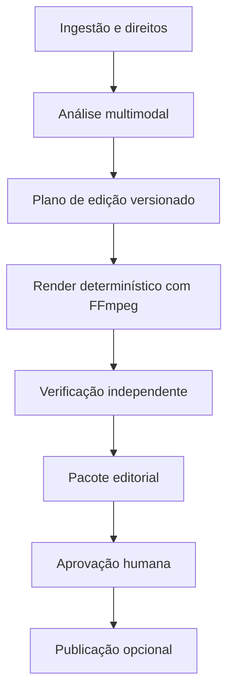

# Plano de evolução do `youtube_clipper`

**Data da pesquisa:** 28 de julho de 2026  
**Repositório analisado:** [Pedro31051/youtube_clipper](https://github.com/Pedro31051/youtube_clipper)  
**Objetivo:** transformar o projeto atual em um editor automático de vídeos e Shorts com planejamento editorial, cortes, áudio, tradução, thumbnails e renderização reproduzível.

## 1. Resumo executivo

O projeto já tem uma base útil: download/ingestão, transcrição com Faster Whisper, detecção de cenas, seleção de trechos, corte temporal, conversão vertical, legendas ASS, normalização de áudio, narração externa, overlay analítico, renderização com NVENC e fallback CPU, relatórios e evidências.

O maior bloqueio para crescer não é a falta de mais filtros. É a existência de **dois caminhos de orquestração**:

- `src/youtube_clipper/pipeline.py`: pipeline antigo e simples;
- `src/cortes/pipeline.py`: pipeline auditado e mais completo.

Antes de adicionar recursos, o projeto deve consolidar `cortes.pipeline` como núcleo e introduzir um **plano de edição canônico**, em JSON e opcionalmente OpenTimelineIO. A inteligência analisa e propõe; o plano registra cada decisão; o FFmpeg executa; um verificador independente mede o resultado.

A ordem recomendada é:

1. consolidar arquitetura, dependências, licença e ambiente;
2. implementar timeline e corte automático de silêncio;
3. melhorar transcrição, legendas e voz;
4. adicionar reenquadramento inteligente;
5. criar seleção semântica de clipes;
6. gerar thumbnails;
7. gerar/mixar trilha e efeitos sonoros;
8. traduzir legendas e dublar;
9. adicionar B-roll, efeitos e templates;
10. somente depois, integrar publicação e aprendizagem por métricas.

Com uma pessoa trabalhando em tempo integral, a expansão até tradução/dublagem é estimada em **35 a 55 dias úteis**, sem contar aprovações, espera por APIs ou uma interface web. O projeto deve continuar avançando fase por fase, com um vídeo de referência e critérios objetivos por fase.

## 2. O que existe hoje

### Capacidades encontradas

| Área | Estado atual | Observação |
|---|---|---|
| Ingestão | Existe | URL via `yt-dlp` e arquivo local |
| Transcrição | Existe | Faster Whisper |
| Cenas | Existe | PySceneDetect |
| Seleção | Parcial | Densidade de fala e regras |
| Corte | Existe | Intervalos temporais |
| Formato vertical | Existe | Crop central ou fundo desfocado |
| Legendas | Existe | ASS, inclusive por palavra |
| Áudio | Parcial | Loudness em duas passadas e narração fornecida externamente |
| Camada editorial | Existe | Narração e/ou overlay analítico |
| Render | Existe | FFmpeg, NVENC com fallback |
| Auditoria | Forte | `events.jsonl`, evidências, relatórios e runs imutáveis |
| CI | Existe | Python 3.12, FFmpeg e suíte CPU |

### Limitações confirmadas

- O render rápido depende de NVIDIA/NVENC; o relatório T3 registra cerca de 8,68 s em CPU para um clipe sintético de 5 s.
- O PySceneDetect precisa de ajuste em vídeos estáticos ou com transições suaves.
- Fontes 4K pressionam RAM e VRAM.
- A validação CUDA depende de runner próprio com GPU.
- A narração atual recebe um áudio já produzido; ainda não existe provedor de TTS no pipeline.
- Não há Dockerfile nem lock de dependências.
- As dependências usam intervalos amplos de versão.
- O repositório não expõe um arquivo `LICENSE` na raiz. Isso deve ser corrigido antes de distribuir ou receber contribuições.
- A regra do projeto exige testes reais no caminho crítico, porém parte do histórico de testes usa simulações. Os testes de contrato precisam ser separados dos testes end-to-end reais.

## 3. Arquitetura-alvo

### Fluxo



### Decisões arquiteturais

1. **Um único orquestrador:** manter `cortes.pipeline`; transformar o pipeline antigo em um adaptador de compatibilidade e depois removê-lo em uma versão maior.
2. **FFmpeg como renderizador principal:** Python planeja e coordena; FFmpeg corta, compõe, mistura e codifica. MoviePy não deve virar o núcleo.
3. **Timeline antes do render:** nenhuma IA chama FFmpeg diretamente. Ela produz uma proposta validada contra um schema.
4. **Provedores substituíveis:** Gemini, serviços locais e futuros provedores implementam interfaces pequenas. Nenhum model ID fica espalhado pelo código.
5. **Execução por capacidades:** detectar CPU, CUDA, NVENC, memória e filtros do FFmpeg; escolher o perfil compatível.
6. **Artefatos reproduzíveis:** prompts, modelos, seeds quando disponíveis, hashes, licenças e comandos fazem parte da run.
7. **Publicação separada:** upload para YouTube nunca faz parte do render e exige aprovação humana explícita.

### Artefatos de uma run

```text
run/
  source_manifest.json
  analysis/
    media.json
    transcript.json
    scenes.json
    speech.json
    faces.json
    music.json
  edit_plan.json
  timeline.otio
  captions/
    original.ass
    pt-BR.ass
  audio/
    narration.wav
    soundtrack.wav
    mix_manifest.json
  thumbnails/
    candidate-01.png
    candidate-02.png
    manifest.json
  output/
    short.mp4
  verify_result.json
  events.jsonl
```

### Schema mínimo de `edit_plan.json`

Cada operação deve conter `id`, `type`, `source_range`, `output_range`, `parameters`, `reason`, `confidence` e `evidence_refs`.

Tipos iniciais:

- `keep`, `remove`, `speed`, `transition`;
- `reframe`, `zoom`, `overlay`, `caption`;
- `duck`, `normalize`, `denoise`, `narration`, `music`, `sfx`;
- `broll`, `generated_image`;
- `translation`, `dub`.

[OpenTimelineIO](https://github.com/AcademySoftwareFoundation/OpenTimelineIO) deve ser usado como formato de intercâmbio e inspeção de timeline, não como renderizador. A licença é Apache-2.0.

## 4. Matriz de requisitos e projetos que ajudam

| Requisito | Solução recomendada | Projeto/API auxiliar | Decisão |
|---|---|---|---|
| Cortar silêncio e períodos vazios | VAD + margens + timeline própria | [Silero VAD](https://github.com/snakers4/silero-vad), [Auto-Editor](https://github.com/wyattblue/auto-editor) | Silero no núcleo; Auto-Editor como referência e importador opcional |
| Remover palavras de preenchimento | Transcript/word timestamps + regras por idioma | [WhisperX](https://github.com/m-bain/whisperX) | Integrar como modo avançado |
| Legenda precisa | Alinhamento por palavra, quebra semântica e safe areas | WhisperX + `pysubs2` | Manter `pysubs2`; adicionar alinhamento |
| Limpar voz | Denoise antes do loudness | [DeepFilterNet](https://github.com/Rikorose/DeepFilterNet) | Extra opcional de áudio |
| Reenquadrar pessoa/objeto | Face landmarks + tracking suavizado | [MediaPipe](https://github.com/google-ai-edge/mediapipe), [ByteTrack](https://github.com/FoundationVision/ByteTrack), [OpenCV](https://opencv.org/) | MediaPipe primeiro; ByteTrack só para casos complexos |
| Detectar cortes | Cena + fala + movimento | PySceneDetect + OpenCV | Evoluir o que já existe |
| Selecionar melhores momentos | Regras locais + ranking semântico estruturado | Faster Whisper/WhisperX + Gemini opcional | IA apenas propõe intervalos |
| Criar thumbnail | Frames + recorte + remoção de fundo + composição + geração | [Pillow](https://github.com/python-pillow/Pillow), [rembg](https://github.com/danielgatis/rembg), [Gemini Image](https://ai.google.dev/gemini-api/docs/image-generation) | Três candidatos; texto renderizado localmente |
| Criar narração | Roteiro + TTS | [Gemini TTS](https://ai.google.dev/gemini-api/docs/speech-generation), [Coqui TTS](https://github.com/idiap/coqui-ai-TTS) | Gemini primário; Coqui como fallback opcional |
| Criar trilha sonora | Briefing musical + geração + beat grid + mixagem | [Lyria 3](https://ai.google.dev/gemini-api/docs/music-generation), [librosa](https://librosa.org/) | Lyria gera; librosa analisa; FFmpeg mistura |
| Traduzir | Tradução contextual preservando timestamps | Gemini + [Argos Translate](https://github.com/argosopentech/argos-translate) | Gemini primário; Argos offline |
| Dublar | Tradução, TTS por bloco e ajuste temporal | Gemini TTS + FFmpeg | Sem clonagem de voz por padrão |
| B-roll e imagens | Plano de inserções com proveniência | Gemini Image e banco licenciado | Só ativos com licença registrada |
| Efeitos e transições | Templates declarativos | FFmpeg filters | Biblioteca pequena e testada |
| Publicar thumbnail | Etapa separada, após aprovação | [YouTube Data API `thumbnails.set`](https://developers.google.com/youtube/v3/docs/thumbnails/set) | Futuro; nunca automático por padrão |

## 5. Planejamento por fases

As estimativas abaixo pressupõem uma pessoa, familiaridade com Python/FFmpeg e um vídeo de referência de 10–30 minutos.

### Fase 0 — fundação e consolidação

**Estimativa:** 3–5 dias

Entregas:

- definir `src/cortes` como implementação canônica;
- adicionar uma CLI única, mantendo aliases de compatibilidade;
- criar `EditPlan` com Pydantic/JSON Schema e migração de versão;
- adicionar OpenTimelineIO como extra opcional;
- separar dependências em `core`, `audio`, `vision`, `gemini`, `dev`;
- produzir lock para CPU e GPU;
- criar Dockerfile CPU e perfil GPU;
- adicionar `LICENSE`, `NOTICE` e inventário de dependências/modelos;
- registrar `ffmpeg -version`, `ffmpeg -buildconf`, CUDA/NVENC e memória;
- alinhar CI com as regras do `agents.md`.

Critérios de aceite:

- o mesmo comando processa URL e arquivo local;
- uma run antiga pode ser reproduzida pelo novo orquestrador;
- `edit_plan.json` é validado antes de qualquer render;
- CI executa testes de unidade/contrato; job separado executa integração real;
- nenhum recurso novo depende do pipeline antigo.

### Fase 1 — corte automático de silêncio e ritmo

**Estimativa:** 4–6 dias

Implementação:

- extrair áudio mono em 16 kHz;
- detectar voz com Silero VAD;
- classificar intervalos em fala, silêncio curto, pausa editorial e vazio longo;
- aplicar `padding_before`, `padding_after`, duração mínima e proteção de respiração;
- preservar pausas curtas para não produzir fala robótica;
- permitir `remove`, `keep` ou `speed_up` por regra;
- usar word timestamps para remover interjeições configuradas por idioma;
- fundir operações adjacentes em uma timeline;
- adicionar `--preview-plan` e comparação antes/depois.

Perfil inicial sugerido:

- silêncio menor que 250 ms: manter;
- 250–700 ms: reduzir com cautela;
- maior que 700 ms: candidato a corte;
- manter 80–150 ms de margem ao redor da fala;
- nunca cortar sobre mudança de cena sem regra explícita.

Esses valores são configuração inicial, não verdade universal. Devem ser calibrados por tipo de vídeo.

Critérios de aceite:

- não cortar fonemas em um conjunto de referência;
- reduzir o tempo vazio medido sem remover frases;
- plano explicar cada remoção;
- teste de mutação falhar quando os intervalos de corte forem alterados;
- preview produz EDL/OTIO sem render completo.

### Fase 2 — transcrição, legendas e tratamento de voz

**Estimativa:** 4–7 dias

Implementação:

- adicionar adaptador WhisperX para alinhamento por palavra, VAD e diarização opcional;
- continuar aceitando Faster Whisper como modo leve;
- criar quebra de legenda por pontuação, largura, duração e velocidade de leitura;
- criar temas ASS versionados com safe areas;
- aplicar DeepFilterNet de forma opcional antes do loudness;
- medir LUFS integrado, true peak e intelligibility;
- manter trilhas intermediárias em WAV até a codificação final.

Riscos:

- diarização pode exigir modelos e termos externos;
- WhisperX adiciona versões sensíveis de PyTorch/CUDA;
- denoise agressivo pode criar artefatos.

Critérios de aceite:

- legenda respeita palavra, tempo e margem;
- sincronia máxima de referência definida e testada;
- saída de áudio não clipa;
- modos CPU e GPU produzem artefatos semanticamente equivalentes.

### Fase 3 — reenquadramento inteligente

**Estimativa:** 5–8 dias

Implementação:

- detectar rosto e landmarks com MediaPipe;
- construir uma trilha temporal de posição e escala;
- suavizar trajetória para evitar crop tremendo;
- aplicar regras de headroom e safe area da legenda;
- alternar entre `center_crop`, `face_track`, `two_person` e `blur_background`;
- usar OpenCV para movimento e optical flow quando o rosto some;
- considerar ByteTrack apenas se houver necessidade real de rastrear objetos/pessoas múltiplas.

Critérios de aceite:

- rosto principal permanece dentro da zona segura;
- deslocamento por frame fica abaixo do limite de tremor;
- fallback funciona quando nenhum rosto é encontrado;
- detecção roda uma vez; o render consome apenas a trajetória registrada.

### Fase 4 — seleção semântica de clipes

**Estimativa:** 4–7 dias

Implementação:

- gerar candidatos usando cenas, VAD, frases completas e duração;
- calcular sinais locais: densidade, novidade, clareza, gancho inicial e fechamento;
- pedir ao Gemini, opcionalmente, um ranking em JSON estruturado;
- impedir que o modelo invente timestamps: candidatos válidos já chegam enumerados;
- selecionar um conjunto diverso, evitando trechos sobrepostos;
- produzir título, descrição, justificativa e risco para cada candidato;
- exigir camada editorial original conforme a regra atual do projeto.

Critérios de aceite:

- todo intervalo escolhido existe na transcrição e na fonte;
- nenhum Short ultrapassa a duração configurada;
- seleção continua operando sem API externa;
- ranking é reproduzível com prompt/modelo registrados;
- uma aprovação humana pode aceitar, editar ou rejeitar candidatos.

### Fase 5 — thumbnails

**Estimativa:** 4–6 dias

O nome correto no YouTube é **thumbnail**, a imagem mostrada antes de o vídeo começar.

Pipeline:

1. extrair 8–20 frames candidatos por nitidez, expressão, contraste e ausência de blur;
2. remover duplicatas perceptuais;
3. recortar o sujeito com `rembg`, quando necessário;
4. pedir ao Gemini Image variações ou fundo complementar;
5. compor título, faixa, contorno e identidade visual com Pillow;
6. validar legibilidade em tamanho pequeno;
7. exportar três candidatos e um manifesto de proveniência.

Decisão importante: o Gemini pode criar ou editar o visual, mas o texto final deve ser desenhado localmente com Pillow. Isso dá consistência de fonte, ortografia, safe area e repetibilidade. O Gemini Image atual aceita geração/edição multimodal e alguns modelos aceitam vídeo como referência; a integração deve usar um adaptador, porque modelos e disponibilidade mudam.

Critérios de aceite:

- formatos 1280×720 e proporção 16:9 por padrão;
- JPEG/PNG dentro do limite aceito pelo YouTube;
- texto legível em preview de 320 px;
- sem elementos cortados pela safe area;
- `manifest.json` registra frame, prompt, modelo, hash e origem de cada ativo;
- upload só ocorre após aprovação.

### Fase 6 — narração, trilha sonora e efeitos

**Estimativa:** 5–8 dias

Implementação:

- gerar roteiro de narração com duração-alvo e marcações;
- sintetizar com Gemini TTS por blocos;
- permitir Coqui TTS como extra local, verificando também a licença do modelo de voz;
- gerar briefing musical a partir de tema, energia e duração;
- gerar trilha com Lyria por um provedor isolado;
- analisar BPM, batidas e seções com librosa;
- inserir cortes/transições próximos às batidas quando isso não prejudicar fala;
- aplicar sidechain/ducking sob voz;
- usar SFX apenas de biblioteca licenciada ou gerada com proveniência;
- exportar stems e manifesto de mixagem.

Critérios de aceite:

- voz permanece inteligível durante toda a trilha;
- trilha não ultrapassa limites de loudness/true peak;
- falha do provedor não impede render sem música;
- todos os áudios têm origem, licença ou identificador de geração.

### Fase 7 — tradução e dublagem

**Estimativa:** 6–10 dias por primeiro conjunto de idiomas

Implementação:

- traduzir por blocos sem alterar timestamps na primeira passagem;
- preservar glossário, nomes e termos proibidos de traduzir;
- validar comprimento e velocidade de leitura;
- gerar ASS/SRT/VTT por idioma;
- sintetizar TTS por segmento;
- ajustar duração com pausas e `atempo` em faixa limitada;
- remuxar uma faixa de áudio por idioma;
- oferecer Argos Translate como fallback offline.

Não incluir lip-sync no MVP. O Wav2Lip público impõe restrição de uso não comercial nos artefatos disponibilizados, portanto não é adequado como dependência padrão de um pipeline potencialmente monetizado.

Critérios de aceite:

- todos os segmentos preservam identidade temporal;
- nenhuma fala ultrapassa a janela seguinte;
- nomes/glossário passam por verificação;
- trilhas têm language tags corretas;
- comparação humana em amostra antes de liberar cada idioma.

### Fase 8 — B-roll, imagens, templates e efeitos

**Estimativa:** 6–10 dias

Implementação:

- detectar pontos em que uma imagem de apoio melhora compreensão;
- produzir consultas e prompts, nunca downloads sem licença;
- aceitar três fontes: biblioteca do usuário, banco licenciado e geração;
- inserir pan/zoom sutil em imagens;
- criar templates declarativos: `talking_head`, `podcast`, `tutorial`, `gaming`, `news`;
- adicionar transições curtas e poucos efeitos de alto valor;
- limitar densidade de efeitos para não encobrir conteúdo.

Critérios de aceite:

- toda mídia tem `asset_id`, origem, licença e hash;
- o render não depende de rede depois que o pacote de ativos está fechado;
- templates não alteram a precisão das legendas;
- o modo `clean` produz edição sem efeitos.

### Fase 9 — pacote editorial, publicação e aprendizagem

**Estimativa:** 5–8 dias

Implementação:

- gerar vídeo, três thumbnails, títulos, descrição, capítulos e tags sugeridas;
- criar uma tela/relatório de aprovação;
- integrar upload de vídeo/thumbnail apenas como comando separado;
- registrar o ID do vídeo publicado e a versão dos ativos;
- importar métricas agregadas para comparar templates e escolhas;
- nunca alterar automaticamente conteúdo já publicado.

Critérios de aceite:

- `render` não conhece credenciais de publicação;
- publicação exige confirmação explícita;
- credenciais ficam em secret store, nunca em logs;
- rollback significa publicar uma nova versão, não apagar silenciosamente.

## 6. Organização sugerida do código

```text
src/cortes/
  cli.py
  pipeline.py
  capabilities.py
  domain/
    edit_plan.py
    timeline.py
    manifests.py
  analysis/
    transcription.py
    vad.py
    scenes.py
    faces.py
    music.py
  planning/
    silence.py
    highlights.py
    reframe.py
    captions.py
    broll.py
  providers/
    base.py
    gemini_text.py
    gemini_image.py
    gemini_tts.py
    lyria.py
    argos.py
  rendering/
    ffmpeg_graph.py
    captions.py
    audio_mix.py
    thumbnails.py
  verification/
    media.py
    timeline.py
    captions.py
    provenance.py
```

Interfaces principais:

```python
class ContentPlanner:
    def rank_candidates(self, candidates, context) -> RankedCandidates: ...

class ImageGenerator:
    def generate(self, brief, references) -> GeneratedAsset: ...

class SpeechGenerator:
    def synthesize(self, segments, voice) -> AudioAsset: ...

class MusicGenerator:
    def generate(self, brief, duration) -> AudioAsset: ...

class Translator:
    def translate(self, segments, target_language, glossary) -> Translation: ...
```

## 7. Dependências: adotar, isolar ou evitar

### Adotar no núcleo ou em extras oficiais

| Projeto | Uso | Licença observada | Cuidados |
|---|---|---|---|
| Silero VAD | Fala/silêncio | MIT | Fixar versão e modelo |
| WhisperX | Alinhamento/diarização | BSD-2-Clause | Compatibilidade CUDA e termos dos modelos |
| OpenTimelineIO | Timeline/EDL | Apache-2.0 | Não renderiza mídia |
| MediaPipe | Rosto/landmarks | Apache-2.0 | Tamanho do extra de visão |
| DeepFilterNet | Denoise | MIT ou Apache-2.0 | Tornar opcional |
| Pillow | Composição de thumbnail | HPND | Fontes também precisam de licença |
| rembg | Remoção de fundo | MIT | Licença dos pesos/modelos deve ser inventariada |
| Argos Translate | Tradução offline | MIT | Qualidade varia por par de idiomas |

### Usar como referência ou adaptador opcional

- **Auto-Editor:** excelente referência para regras por loudness/motion e exportação de timeline; licença Unlicense. A timeline própria oferece mais auditoria e controle.
- **ByteTrack:** útil para tracking multiobjeto, mas requer detector e aumenta o custo operacional.
- **Coqui TTS:** toolkit MPL-2.0; cada modelo de voz tem licença própria e precisa ser verificado.
- **PyAV:** útil para acesso preciso a frames e metadados; FFmpeg CLI continua sendo o renderizador.

### Não adotar como dependência padrão

- **stable-ts:** arquivado em maio de 2026.
- **Demucs original:** repositório arquivado em janeiro de 2025; usar apenas por adaptador se houver fork mantido e licença de pesos confirmada.
- **LibreTranslate embutido:** AGPL-3.0 aumenta as obrigações; se necessário, avaliar como serviço separado.
- **Wav2Lip público:** artefatos liberados para uso pessoal/pesquisa/não comercial.
- **AudioCraft/MusicGen:** código MIT, mas pesos públicos com licença não comercial; inadequado para canal monetizado.
- **MoviePy como núcleo:** duplicaria funções já melhor atendidas pelo FFmpeg e adicionaria outra abstração de timeline/render.

## 8. Estratégia de testes e qualidade

### Pirâmide de testes

1. **Unidade:** schemas, cálculo de intervalos, legendas, regras de mixagem.
2. **Contrato:** provedores Gemini/Argos e compilação do filtergraph.
3. **Integração real:** FFmpeg/ffprobe, VAD, Whisper e análise de frames sem mocks.
4. **Golden run:** vídeo sintético e fonte autorizada com hashes esperados.
5. **Mutação:** deslocar cortes, remover overlay, quebrar loudness ou trocar licença deve fazer o verificador falhar.
6. **GPU:** job manual em runner CUDA/NVENC.

### Métricas

- cobertura de fala preservada;
- silêncio removido;
- erro de sincronia de legenda;
- percentagem de frames com sujeito na safe area;
- LUFS e true peak;
- tempo por minuto de fonte;
- pico de RAM/VRAM;
- custo por minuto por provedor;
- taxa de runs com fallback;
- aprovação/rejeição humana dos candidatos.

### Orçamento operacional

Cada recurso deve ter limites:

- `max_source_minutes`;
- `max_generated_images`;
- `max_tts_seconds`;
- `max_music_seconds`;
- `max_api_cost`;
- timeout e retry com backoff;
- cache por hash de entrada + versão do modelo + parâmetros.

## 9. Backlog priorizado

### P0 — antes de novos recursos

- [ ] Unificar pipelines.
- [ ] Adicionar licença do projeto.
- [ ] Criar `EditPlan` e versionamento.
- [ ] Fixar dependências e perfis CPU/GPU.
- [ ] Criar container e capability probe.
- [ ] Separar testes simulados dos testes reais.

### P1 — primeiro salto de valor

- [ ] Silero VAD e corte de silêncio.
- [ ] Preview de timeline/OTIO.
- [ ] WhisperX opcional.
- [ ] DeepFilterNet opcional.
- [ ] Reenquadramento MediaPipe.

### P2 — automação editorial

- [ ] Ranking de momentos.
- [ ] Três thumbnails.
- [ ] Gemini TTS.
- [ ] Lyria + análise de batidas.
- [ ] Tradução e faixas dubladas.

### P3 — acabamento e operação

- [ ] B-roll com proveniência.
- [ ] Templates e efeitos.
- [ ] Relatório de aprovação.
- [ ] Publicação separada.
- [ ] Métricas pós-publicação.

## 10. Primeira entrega recomendada

O primeiro marco não deve tentar implementar tudo. Deve entregar um **Short vertical editado automaticamente, mas completamente auditável**, com:

- ingestão autorizada;
- transcrição;
- remoção segura de silêncio;
- seleção de um trecho;
- reenquadramento de rosto;
- legenda;
- denoise e loudness;
- narração opcional;
- uma thumbnail determinística;
- `edit_plan.json`, `timeline.otio` e relatório de verificação.

Esse marco valida a nova arquitetura. Gemini Image, TTS, Lyria, tradução e B-roll entram depois por adaptadores sem reescrever o núcleo.

## 11. Fontes principais

### Projeto e infraestrutura

- [Repositório `youtube_clipper`](https://github.com/Pedro31051/youtube_clipper)
- [Filtros do FFmpeg](https://ffmpeg.org/ffmpeg-filters.html)
- [PyAV](https://pyav.org/docs/stable/)
- [OpenCV optical flow](https://docs.opencv.org/4.x/d4/dee/tutorial_optical_flow.html)

### Google/Gemini e YouTube

- [Gemini: geração e edição de imagens](https://ai.google.dev/gemini-api/docs/image-generation)
- [Gemini: geração de fala/TTS](https://ai.google.dev/gemini-api/docs/speech-generation)
- [Gemini: entendimento de áudio](https://ai.google.dev/gemini-api/docs/audio)
- [Lyria 3: geração de música](https://ai.google.dev/gemini-api/docs/music-generation)
- [YouTube Data API: `thumbnails.set`](https://developers.google.com/youtube/v3/docs/thumbnails/set)

### Open source

- [Auto-Editor](https://github.com/wyattblue/auto-editor)
- [WhisperX](https://github.com/m-bain/whisperX)
- [Silero VAD](https://github.com/snakers4/silero-vad)
- [DeepFilterNet](https://github.com/Rikorose/DeepFilterNet)
- [MediaPipe](https://github.com/google-ai-edge/mediapipe)
- [ByteTrack](https://github.com/FoundationVision/ByteTrack)
- [OpenTimelineIO](https://github.com/AcademySoftwareFoundation/OpenTimelineIO)
- [Argos Translate](https://github.com/argosopentech/argos-translate)
- [Pillow](https://github.com/python-pillow/Pillow)
- [rembg](https://github.com/danielgatis/rembg)
- [Coqui TTS mantido pela Idiap](https://github.com/idiap/coqui-ai-TTS)

## 12. Decisões que ainda exigem o dono do projeto

Antes da implementação da Fase 0, definir:

1. licença desejada para o projeto;
2. alvo principal: Shorts, vídeos longos ou ambos;
3. idiomas iniciais de tradução/dublagem;
4. orçamento mensal aceitável para APIs;
5. hardware mínimo suportado;
6. se o produto será CLI, serviço ou também interface web;
7. se haverá uso comercial/monetização desde o início.

Essas decisões não impedem a consolidação arquitetural, mas alteram provedores, testes, empacotamento e obrigações de licença.
