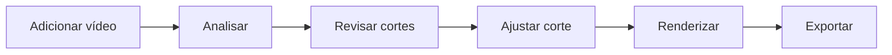
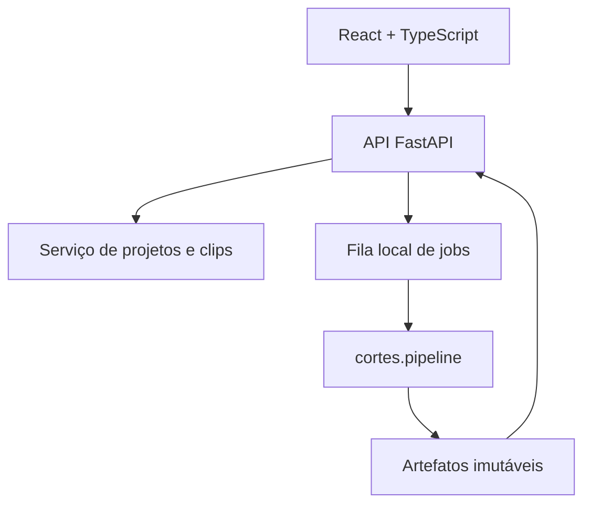
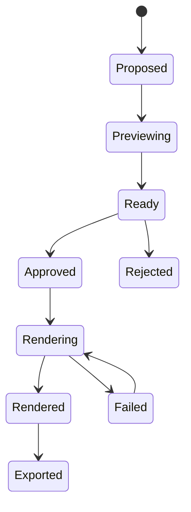

# Plano intermediário — painel funcional e moderno do YouTube Clipper

**Data:** 28 de julho de 2026  
**Repositório analisado:** [Pedro31051/youtube_clipper](https://github.com/Pedro31051/youtube_clipper)  
**Posição no roadmap:** fase obrigatória entre a estabilização do pipeline atual e a inclusão de novas edições.

## 1. Decisão executiva

O projeto deve **congelar temporariamente a inclusão de novas funções** e executar uma fase intermediária dedicada ao painel.

O objetivo não é construir agora um clone completo do CapCut. O objetivo é criar uma central de trabalho que:

- represente corretamente cada vídeo, corte, preview, render e upload;
- exponha as edições que o backend já executa;
- permita aprovar e ajustar um corte sem usar a CLI;
- mostre progresso e falhas reais;
- tenha aparência profissional e consistente;
- consiga receber novas funções depois sem virar uma “nave espacial”.

O painel atual não precisa apenas de redesign. Ele precisa de **reconexão com o domínio real do projeto**.

## 2. Diagnóstico confirmado no código

### 2.1 Arquitetura atual do painel

O arquivo [`src/youtube_clipper/web_dashboard.py`](https://github.com/Pedro31051/youtube_clipper/blob/main/src/youtube_clipper/web_dashboard.py) reúne em quase 900 linhas:

- servidor HTTP;
- rotas de API;
- HTML;
- CSS;
- JavaScript;
- processamento de vídeo;
- Google Drive;
- autenticação;
- download de arquivos.

Isso dificulta testes, evolução visual, reaproveitamento e sincronização de estado.

O painel importa:

```python
from youtube_clipper.pipeline import run_pipeline
```

Porém o núcleo mais completo e auditado está em:

```python
from cortes.pipeline import run_full_pipeline
```

O painel, portanto, opera o pipeline antigo e expõe apenas uma fração dos recursos já presentes em `cortes.pipeline`.

### 2.2 Por que o vídeo de cada card não corresponde ao corte

O código cria apenas:

```html
<video id="clipPreviewPlayer">
```

Esse player fica fora dos cards e é compartilhado por todos eles. Quando qualquer corte termina, o JavaScript apenas troca:

```javascript
verticalPlayer.src = data.download_url;
```

Consequências:

- nenhum card possui player próprio;
- nenhum card recebe um `clip_id` estável;
- o card não recebe `preview_url`, `poster_url` ou versão do artefato;
- gerar o corte 2 substitui o vídeo global que antes mostrava o corte 1;
- a origem exibida é um iframe completo do YouTube, não o intervalo do corte;
- não existe proteção clara contra cache de um arquivo anterior com o mesmo nome;
- não existe teste que prove a correspondência entre card, timestamps e mídia.

### 2.3 Funções existentes que o painel não expõe

O pipeline `cortes.pipeline` já trabalha com:

- transcrição;
- detecção de cenas;
- seleção de corte;
- corte temporal;
- legendas;
- normalização de áudio;
- modo vertical;
- fundo desfocado;
- overlay analítico;
- texto de overlay;
- narração externa;
- narração TTS sinalizada;
- variante de template;
- exigência de transformação editorial;
- relatório e evidências.

No painel atual, o usuário controla basicamente:

- URL;
- pasta do Drive;
- fundo desfocado ou crop central;
- gerar corte;
- enviar ao Drive.

O painel passa a impressão de possuir uma automação rica, mas não permite controlar ou sequer visualizar a maior parte dela.

### 2.4 Problemas adicionais encontrados

| Problema | Efeito |
|---|---|
| URL de exemplo preenchida no código | Pode iniciar análise do vídeo errado |
| ID de pasta do Drive embutido no HTML | Configuração e dado operacional misturados à interface |
| Uso extensivo de `innerHTML` com título, tags e transcrição | Aumenta o risco de HTML não confiável ser interpretado |
| `alert()` como sistema de erro | Falhas somem e não deixam histórico |
| Spinner único para todas as tarefas | Não mostra qual corte está sendo processado |
| Etapas visuais estáticas | Parecem progresso, mas não refletem eventos do backend |
| Download lê o MP4 inteiro em memória | Ineficiente para vídeos grandes |
| Endpoint de vídeo não implementa HTTP Range | Seek e preview podem funcionar mal |
| Sem projeto, run ou clip persistente | Recarregar a página perde o contexto |
| Sem teste em navegador real | Os testes confirmam HTML/API, não reprodução ou interação |
| Estilo glassmorphism roxo/rosa | Visual chamativo, pouco adequado a uma ferramenta de produção |
| Emojis como ícones | Aparência inconsistente entre sistemas |

Os testes atuais verificam status HTTP, presença de strings no HTML e respostas simuladas. Eles não confirmam:

- que o card correto reproduz o corte correto;
- que a duração do preview corresponde ao intervalo;
- que dois cards mantêm vídeos independentes;
- que seek funciona;
- que botões alteram o plano de edição;
- que progresso visual acompanha o pipeline;
- que o layout funciona em resoluções diferentes.

## 3. Princípio de produto: aprovação primeiro, edição profunda depois

O sistema é um editor automático. A interface intermediária deve otimizar este fluxo:



Não deve começar como um editor universal com dezenas de faixas, keyframes e efeitos. Isso aumentaria o custo sem resolver o problema principal.

### Regra de revelação progressiva

Cada corte terá três níveis:

1. **Revisar:** assistir, aprovar, rejeitar e comparar.
2. **Ajustar:** início/fim, formato, legenda, overlay, narração e áudio.
3. **Avançado:** template, parâmetros finos, GPU e evidências — escondidos por padrão.

## 4. Arquitetura recomendada

### 4.1 Separação



### 4.2 Frontend

Recomendação:

- React;
- TypeScript;
- Vite;
- Tailwind CSS;
- shadcn/ui;
- TanStack Query;
- Zustand apenas para estado temporário do editor;
- Vidstack Player;
- wavesurfer.js;
- Lucide Icons;
- Playwright.

Vite é suficiente. Next.js adicionaria servidor e convenções que não trazem benefício importante para um painel local/interno sem SEO.

### 4.3 Backend

Substituir gradualmente `ThreadingHTTPServer` por:

- FastAPI;
- Pydantic para contratos;
- OpenAPI como fonte dos tipos do frontend;
- SSE para progresso;
- worker separado para FFmpeg/Whisper;
- SQLite para metadados de projetos/jobs;
- filesystem para vídeos, previews e relatórios.

O FastAPI possui suporte documentado a [Server-Sent Events](https://fastapi.tiangolo.com/tutorial/server-sent-events/), adequado para enviar progresso do servidor ao navegador.

Não executar renderizações longas diretamente dentro da requisição HTTP. A API cria um job, o worker executa e a tela acompanha os eventos.

### 4.4 Contrato de identidade

Todo objeto deve possuir identificador:

```text
project_id
source_id
analysis_id
clip_id
preview_id
render_id
asset_id
job_id
```

Nenhum card deve depender de `rank` como identidade. O rank pode mudar; `clip_id` não.

Cada artefato deve ter:

```json
{
  "asset_id": "ast_...",
  "clip_id": "clp_...",
  "kind": "preview",
  "version": 3,
  "sha256": "...",
  "duration_ms": 38120,
  "width": 360,
  "height": 640,
  "mime_type": "video/mp4",
  "url": "/api/v1/assets/ast_...?v=3"
}
```

O parâmetro de versão evita que o navegador exiba um preview antigo.

## 5. Como garantir que cada card mostre o corte correto

### 5.1 Preview intermediário

Depois da análise, o backend cria para cada candidato:

- `clip_id`;
- timestamp inicial e final em milissegundos;
- poster extraído do próprio intervalo;
- preview MP4 leve;
- versão do plano;
- status do job.

Perfil recomendado do preview:

- 360×640 ou 480×854;
- H.264;
- `faststart`;
- preset rápido;
- mesmo início/fim do render final;
- mesmo reenquadramento;
- legenda opcional;
- áudio comprimido;
- arquivo independente por `clip_id` e versão.

O preview usa o mesmo plano e o mesmo compilador de filtros do render final. Apenas resolução, bitrate e preset mudam. Assim, o que aparece na tela é uma aproximação fiel, não um vídeo aleatório com uma moldura bonita.

### 5.2 Card

Cada card recebe:

```json
{
  "clip_id": "clp_01",
  "title": "Título sugerido",
  "start_ms": 64320,
  "end_ms": 102440,
  "duration_ms": 38120,
  "score": 87,
  "poster_url": "/api/v1/assets/poster_01",
  "preview_url": "/api/v1/assets/preview_01?v=1",
  "preview_status": "ready",
  "render_status": "not_started"
}
```

Cada componente monta seu próprio player ou instancia o player ao receber foco. Para evitar cinco vídeos decodificando ao mesmo tempo:

- mostrar poster inicialmente;
- tocar preview ao clicar;
- pausar qualquer outro card quando um começa;
- desmontar players fora da área visível;
- nunca usar autoplay com áudio.

### 5.3 Streaming correto

O endpoint de assets deve:

- responder a `Range`;
- retornar `206 Partial Content`;
- enviar `Accept-Ranges: bytes`;
- definir `Content-Length` e `Content-Range`;
- transmitir o arquivo sem carregá-lo inteiro na RAM;
- usar cache imutável por versão.

### 5.4 Prova automatizada

Criar um teste com três cortes conhecidos:

1. card A começa em tela vermelha;
2. card B começa em tela verde;
3. card C começa em tela azul.

O Playwright abre cada card, captura o primeiro frame e confirma:

- cor esperada;
- duração esperada;
- `currentSrc` diferente;
- clique no card B não altera o card A;
- timestamps mostrados correspondem ao JSON.

## 6. Nova organização da interface

### 6.1 Estrutura geral

```text
┌ Barra superior: projeto | estado | exportar ┐
├ Navegação ┬ Área principal ┬ Inspetor       ┤
│ Projetos  │ Player/Lista   │ Ajustes        │
│ Fonte     │ de cortes      │ do selecionado │
│ Cortes    │                │                 │
├───────────┴────────────────┴─────────────────┤
│ Timeline compacta + waveform                │
└─────────────────────────────────────────────┘
```

### 6.2 Telas

#### Tela 1 — Projetos

- projetos recentes;
- status: rascunho, analisando, revisão, renderizado, exportado;
- thumbnail da fonte;
- duração;
- última atualização;
- botão “Novo projeto”.

#### Tela 2 — Nova análise

- URL do YouTube ou arquivo local;
- idioma;
- quantidade de cortes;
- duração-alvo;
- formato 9:16, 1:1 ou 16:9;
- botão “Analisar”.

Cookies, pasta do Drive, encoder e caminho de saída ficam em Configurações, não no formulário principal.

#### Tela 3 — Revisão de cortes

Cards em lista ou grade com:

- poster real;
- play;
- título;
- início, fim e duração;
- score com explicação;
- status do preview;
- aprovar/rejeitar;
- “Abrir editor”.

Não colocar todos os botões em cada card. A ação principal é “Abrir editor”; exportar e Drive aparecem quando o render existe.

#### Tela 4 — Editor do corte

- coluna esquerda: candidatos;
- centro: player vertical;
- direita: inspetor;
- parte inferior: waveform e intervalo.

Abas do inspetor:

- **Corte:** início, fim e duração;
- **Layout:** crop central ou fundo desfocado;
- **Legendas:** ativar, tema e posição;
- **Áudio:** normalização e narração;
- **Editorial:** overlay, texto e template;
- **Saída:** resolução, preview e render final.

#### Tela 5 — Jobs e exportações

- fila;
- etapa atual;
- tempo decorrido;
- estimativa;
- logs amigáveis;
- tentar novamente;
- baixar;
- enviar ao Drive.

## 7. Design system recomendado

### 7.1 Direção

Usar uma estética de ferramenta profissional, semelhante a um editor de produção:

- superfícies sólidas;
- poucos gradientes;
- hierarquia por espaçamento e contraste;
- bordas discretas;
- uma cor primária;
- estados semânticos separados;
- ícones consistentes;
- densidade moderada.

Remover:

- roxo + rosa + ciano competindo;
- título gigante em gradiente;
- excesso de vidro e blur;
- emojis nos botões;
- cartões flutuando sem relação espacial;
- animações de subida em toda interação.

### 7.2 Paleta “Graphite/Cobalt”

| Token | Cor | Uso |
|---|---:|---|
| `background` | `#090B10` | Fundo principal |
| `surface-1` | `#11151D` | Sidebar e painéis |
| `surface-2` | `#171C26` | Cards e campos |
| `surface-3` | `#202735` | Hover e seleção |
| `border` | `#293244` | Divisórias |
| `text` | `#F5F7FA` | Texto principal |
| `text-muted` | `#98A2B3` | Texto secundário |
| `primary` | `#5B8CFF` | Ação principal |
| `primary-hover` | `#79A2FF` | Hover |
| `success` | `#32D583` | Concluído |
| `warning` | `#F5B942` | Atenção/fila |
| `danger` | `#F97066` | Falha |

Regras:

- azul apenas para ação/seleção;
- verde apenas para sucesso;
- vermelho apenas para falha/destruição;
- score não deve ser automaticamente vermelho/rosa;
- gradiente permitido somente em ilustração vazia ou marca, nunca em todos os botões.

### 7.3 Tipografia e medidas

- Fonte: Inter ou Geist;
- corpo: 14 px;
- labels: 12–13 px;
- títulos de painel: 16–18 px;
- título de página: 24 px;
- raio padrão: 8 px;
- raio grande: 12 px;
- grid de espaçamento: múltiplos de 4;
- sidebar: 224–248 px;
- inspetor: 300–340 px;
- timeline: 160–220 px;
- largura mínima desktop: 1180 px;
- modo compacto abaixo de 1180 px.

### 7.4 Estados obrigatórios

Todo componente ligado ao backend deve ter:

- vazio;
- carregando;
- pronto;
- desatualizado;
- erro;
- desabilitado;
- processando;
- concluído.

Um botão nunca pode parecer disponível quando falta preview, fonte ou render.

## 8. Mapeamento das funções atuais para o painel

| Recurso atual | Onde aparece | Controle |
|---|---|---|
| Ingestão YouTube | Novo projeto | URL |
| Arquivo local | Novo projeto | Upload/seleção |
| Transcrição | Análise | Idioma/modelo em avançado |
| Detecção de cenas | Análise | Automática; detalhes no relatório |
| Seleção de corte | Revisão | Aprovar/rejeitar/reranquear |
| Timestamps | Editor > Corte | Início/fim e handles |
| Crop central | Editor > Layout | Opção visual |
| Fundo desfocado | Editor > Layout | Opção visual |
| Legendas ASS | Editor > Legendas | Ativar/tema/posição |
| Normalização | Editor > Áudio | Ativada por padrão |
| Narração externa | Editor > Áudio | Arquivo/ativo |
| Overlay analítico | Editor > Editorial | Toggle + texto |
| Variante de template | Editor > Editorial | Cards de template |
| Transformação editorial | Validação | Badge/aviso obrigatório |
| NVENC/fallback | Configurações avançadas | Automático por padrão |
| Relatório | Detalhes da run | Abrir/baixar |
| Google Drive | Exportação | Destino configurado |

## 9. API proposta

```text
POST   /api/v1/projects
GET    /api/v1/projects
GET    /api/v1/projects/{project_id}

POST   /api/v1/projects/{project_id}/analysis-jobs
GET    /api/v1/projects/{project_id}/clips

GET    /api/v1/clips/{clip_id}
PATCH  /api/v1/clips/{clip_id}
POST   /api/v1/clips/{clip_id}/preview-jobs
POST   /api/v1/clips/{clip_id}/render-jobs

GET    /api/v1/jobs/{job_id}
GET    /api/v1/jobs/{job_id}/events
POST   /api/v1/jobs/{job_id}/retry
POST   /api/v1/jobs/{job_id}/cancel

GET    /api/v1/assets/{asset_id}
POST   /api/v1/renders/{render_id}/exports
```

### Máquina de estados



Não aceitar estados impossíveis, como exportar um corte que ainda não foi renderizado.

## 10. Open source pesquisado

### Adotar como componentes

| Projeto | Uso recomendado | Licença/observação |
|---|---|---|
| [shadcn/ui](https://github.com/shadcn-ui/ui) | Base visual acessível e customizável | MIT |
| [Vidstack Player](https://github.com/vidstack/player) | Player de vídeo acessível | MIT |
| [wavesurfer.js](https://github.com/katspaugh/wavesurfer.js) | Waveform, timeline e regiões | Plugins oficiais de Regions e Timeline |
| [dnd-kit](https://github.com/clauderic/dnd-kit) | Reordenação futura e interação acessível | MIT |
| [React Timeline Editor](https://github.com/xzdarcy/react-timeline-editor) | Referência/componente para timeline compacta | MIT |
| [Lucide](https://github.com/lucide-icons/lucide) | Ícones consistentes | ISC |
| [TanStack Query](https://github.com/TanStack/query) | Cache e estado de servidor | MIT |
| [Zustand](https://github.com/pmndrs/zustand) | Estado temporário do editor | MIT |
| [Playwright](https://github.com/microsoft/playwright) | Testes reais do painel | Apache-2.0 |

### Usar como referência, não copiar inteiro

#### [OpenCut](https://github.com/opencut-app/opencut)

- MIT;
- forte referência de organização de editor;
- está em reescrita;
- a versão clássica foi arquivada.

Decisão: observar arquitetura e padrões, sem depender do código em transição.

#### [FreeCut](https://github.com/walterlow/freecut)

- MIT;
- excelente referência para preview, waveform, filmstrip, timeline, cache e testes;
- escopo muito maior que o necessário;
- usa WebGPU/WebCodecs e edição completa no navegador.

Decisão: estudar layout, arquitetura por features e testes; não importar o motor.

#### [OpenReel Video](https://github.com/Augani/openreel-video)

- MIT;
- possui timeline, preview e ferramentas de edição;
- projeto recente e com issues de persistência/configuração;
- render no navegador duplicaria o FFmpeg/GPU do projeto.

Decisão: referência visual e de interação.

#### [Descript](https://help.descript.com/hc/en-us/articles/37585546799757-The-editor-interface)

Organiza edição em script, cena, timeline e painéis laterais. É uma boa referência para revelar complexidade conforme a seleção.

#### [OpusClip](https://www.opus.pro/)

É a principal referência de fluxo:

- inserir fonte;
- analisar;
- revisar cortes;
- editar um candidato;
- aplicar template;
- exportar.

Não reproduzir visualmente a marca; copiar apenas a clareza do fluxo.

### Não adotar agora

#### Twick

[Twick](https://github.com/ncounterspecialist/twick) oferece SDK completo, mas utiliza Sustainable Use License, não MIT. Além da análise jurídica, introduziria canvas, render próprio e infraestrutura muito maiores que a necessidade atual.

#### Remotion como motor principal

O projeto já possui render robusto em FFmpeg/Python. Um segundo motor criaria diferenças entre preview e saída final. Pode ser reavaliado para templates React no futuro, mas não nesta fase.

#### Editor completo em WebAssembly/WebCodecs

Duplicaria processamento que já roda na GPU, aumentaria consumo no navegador e criaria inconsistência entre máquinas.

## 11. Fases de implementação

Estimativa para uma pessoa em tempo integral: **24 a 38 dias úteis**. A estimativa inclui testes, migração e correção; não apenas desenhar telas.

### Fase UI-0 — baseline e congelamento

**Estimativa:** 1–2 dias

- congelar novas funções;
- registrar screenshots do painel atual;
- gravar fluxo real de análise → corte → download;
- criar vídeo sintético com três candidatos identificáveis;
- listar todas as flags reais de `cortes.pipeline`;
- definir métricas e critérios.

Saída:

- `BASELINE_PAINEL.md`;
- fixtures de mídia;
- matriz função → API → componente → teste.

Gate:

- nenhum trabalho visual inicia sem caso reproduzível do preview incorreto.

### Fase UI-1 — domínio, IDs e artefatos

**Estimativa:** 3–5 dias

- introduzir Project, Clip, Job e Asset;
- persistir metadados em SQLite;
- gerar nomes imutáveis por ID e versão;
- retirar rank como identidade;
- criar manifesto por clip;
- adaptar `cortes.pipeline` como fonte de execução;
- manter endpoints antigos atrás de adaptador temporário.

Gate:

- dois cortes nunca compartilham o mesmo asset;
- recarregar a página preserva o projeto;
- painel não chama diretamente `youtube_clipper.pipeline`.

### Fase UI-2 — preview correto por corte

**Estimativa:** 4–6 dias

- criar profile de preview;
- gerar poster e MP4 leve por clip;
- implementar streaming HTTP Range;
- retornar `preview_url` e `poster_url`;
- criar job de preview;
- evitar cache incorreto;
- provar correspondência com teste visual.

Gate:

- 10 cards reproduzem 10 cortes distintos;
- duração e timestamps conferem;
- alterar o corte invalida apenas seu preview;
- seek funciona em Safari/Chrome atuais.

### Fase UI-3 — fundação React e API

**Estimativa:** 4–6 dias

- criar `web/` com React/TypeScript/Vite;
- criar API FastAPI versionada;
- gerar cliente TypeScript a partir do OpenAPI;
- integrar TanStack Query;
- implementar SSE;
- criar shell com sidebar, topbar, área principal e inspetor;
- servir build estático pelo backend ou proxy reverso.

Gate:

- nenhuma lógica de UI fica em string Python;
- erros da API aparecem como mensagens persistentes;
- progresso visual vem de eventos reais;
- build frontend e API passam na CI.

### Fase UI-4 — revisão de cortes

**Estimativa:** 3–5 dias

- projetos;
- formulário de análise;
- cards com poster real;
- player sob demanda;
- filtro por status;
- aprovar/rejeitar;
- abrir editor;
- ações de lote limitadas.

Gate:

- usuário completa fonte → análise → revisão sem CLI;
- cada card mostra status correto;
- nenhuma ação principal fica escondida.

### Fase UI-5 — editor compacto

**Estimativa:** 5–8 dias

- player vertical;
- waveform;
- handles de início/fim;
- safe areas;
- inspetor com Corte, Layout, Legendas, Áudio e Editorial;
- autosave com indicador;
- desfazer/refazer dos ajustes de UI;
- regenerar preview;
- render final.

Gate:

- todas as funções já suportadas e aprovadas para UI são ajustáveis;
- mudança no formulário atualiza `edit_plan`;
- preview e render usam o mesmo plano;
- desfazer restaura o estado anterior.

### Fase UI-6 — redesign e design system

**Estimativa:** 3–4 dias

- aplicar paleta Graphite/Cobalt;
- remover glassmorphism e gradientes excessivos;
- substituir emojis por Lucide;
- padronizar estados, campos, botões e dialogs;
- modo compacto;
- skeletons;
- empty states;
- acessibilidade.

Gate:

- contraste WCAG AA;
- navegação principal por teclado;
- nenhum layout quebra em 1180×720, 1440×900 e 1920×1080;
- snapshot visual aprovado.

### Fase UI-7 — exportação, observabilidade e homologação

**Estimativa:** 3–5 dias

- fila e histórico de jobs;
- mensagens de erro acionáveis;
- retry e cancelamento;
- download e Drive em dialog de exportação;
- relatório/evidências;
- Playwright E2E;
- testes de mídia reais;
- orçamento de performance.

Gate:

- fluxo ponta a ponta real;
- falha de YouTube, FFmpeg, GPU ou Drive aparece com causa e ação;
- nenhum teste crítico depende exclusivamente de mocks;
- relatório final inclui vídeo e screenshots.

## 12. Ordem exata recomendada

```text
UI-0 Baseline
  ↓
UI-1 IDs e artefatos
  ↓
UI-2 Preview correto
  ↓
UI-3 React + FastAPI
  ↓
UI-4 Revisão de cortes
  ↓
UI-5 Editor compacto
  ↓
UI-6 Design moderno
  ↓
UI-7 Homologação
```

Não inverter UI-2 e UI-6. Modernizar primeiro produziria uma versão mais bonita do mesmo erro.

## 13. Critérios para considerar o painel “100%”

### Funcionalidade — 35 pontos

- card reproduz seu próprio corte: 10;
- ajustes alteram o plano real: 8;
- todas as funções atuais aprovadas aparecem: 6;
- jobs e erros reais: 5;
- projetos persistem: 3;
- exportação funciona: 3.

### Confiabilidade — 25 pontos

- IDs/artefatos imutáveis: 6;
- preview/render usam o mesmo plano: 6;
- testes de navegador e mídia: 6;
- retry/cancelamento: 4;
- cache correto: 3.

### Experiência — 20 pontos

- fluxo completo sem CLI: 6;
- hierarquia visual: 4;
- complexidade progressiva: 4;
- feedback imediato: 3;
- atalhos e acessibilidade: 3.

### Visual — 10 pontos

- design system consistente: 4;
- responsividade desktop: 2;
- estados vazios/loading/erro: 2;
- tipografia e ícones: 2.

### Performance — 10 pontos

- primeira tela útil abaixo de 2 s em ambiente local: 2;
- interação abaixo de 100 ms: 2;
- poster antes do vídeo: 2;
- preview sem carregar todos os cards: 2;
- streaming/seek eficiente: 2.

**Regra:** não aceitar nota total alta se “card reproduz seu próprio corte” ou “preview/render usam o mesmo plano” estiverem zerados. Esses são gates, não maquiagem estatística.

## 14. Entregável intermediário ideal

Ao final, o usuário deve conseguir:

1. criar um projeto;
2. inserir uma URL ou arquivo;
3. acompanhar a análise;
4. ver cada candidato com seu poster e preview corretos;
5. aprovar um corte;
6. ajustar início/fim, layout, legenda, áudio e camada editorial;
7. regenerar o preview;
8. renderizar;
9. baixar ou enviar ao Drive;
10. abrir relatório e entender qualquer falha.

Somente depois desse gate o roadmap de thumbnails generativas, trilha Gemini/Lyria, tradução, dublagem, remoção de silêncios e B-roll deve voltar a avançar.

## 15. Fontes pesquisadas

- [Painel atual do YouTube Clipper](https://github.com/Pedro31051/youtube_clipper/blob/main/src/youtube_clipper/web_dashboard.py)
- [Pipeline auditado `cortes.pipeline`](https://github.com/Pedro31051/youtube_clipper/blob/main/src/cortes/pipeline.py)
- [Testes atuais do dashboard](https://github.com/Pedro31051/youtube_clipper/blob/main/tests/test_web_dashboard.py)
- [Interface do editor Descript](https://help.descript.com/hc/en-us/articles/37585546799757-The-editor-interface)
- [OpusClip](https://www.opus.pro/)
- [CapCut Desktop](https://www.capcut.com/tools/desktop-video-editor)
- [OpenCut](https://github.com/opencut-app/opencut)
- [FreeCut](https://github.com/walterlow/freecut)
- [OpenReel Video](https://github.com/Augani/openreel-video)
- [Vidstack Player](https://github.com/vidstack/player)
- [wavesurfer.js](https://github.com/katspaugh/wavesurfer.js)
- [shadcn/ui](https://github.com/shadcn-ui/ui)
- [dnd-kit](https://github.com/clauderic/dnd-kit)
- [FastAPI SSE](https://fastapi.tiangolo.com/tutorial/server-sent-events/)
